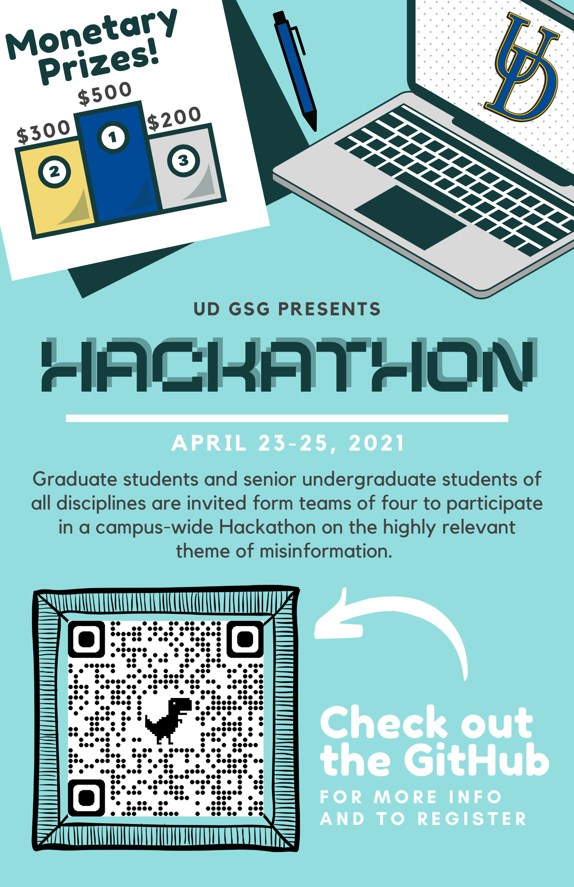

# Hackathon 2021 by Graduate Student Government (GSG) at
## University of Delaware

## Check out our [Website](https://sites.udel.edu/gsg/gsg-hackathon/) for this event ! 

# Register [HERE](https://docs.google.com/forms/d/e/1FAIpQLSdYZDLm4KnUCXbXm5kcL4_1epDoPGJIcW2nmgZC14Pe4UcJ4w/viewform?usp=sf_link) !

### 1:  connect UD community from diverse background ! 

### 2: weeks of planning (It's fun) !

### 3: project tracks to understand the impact of "Misinformation" in our society and its implications ! 

### 4: GSG at UD is taking first step towards the fight against "Misinformation" !

### 5: A platform for students to interact with academic and industrial representatives and learn from workshop and improve CV !  

### 6: awesome projects! - Submit your projects directly to pmondal@udel.edu using the template [templateToProposeProject.md](https://github.com/udgsg/Hackathon2021/blob/main/HackathonProjects/templateToProposeProject.md)!

### 7: hours of writing, coding, visualizing, brainstorming, discussing !

### 8: minutes for each project to share results and lessons learned !

## HACKATHON HOWTO:

A Hackathon is an event where people tackle specific challenges in small groups to produce rapid results that outline issues and promising approaches to solutions. With easier access to internet, misinformation has become a challenging issue with serious repercussions in our society impacting health (Covid reality check, mask/vaccine effectiveness etc), finance (bubble detection, inflation, effect of pandemic on stockmarket, market behavior away from actual economy), media (widespread opinion without facts check via uncountable internet resources). Through this virtual Hackathon, we will focus on various problems associated with "Misinformation" that we as a society are facing nowadays and conclude on the findings in various fields based on data and analysis.   

## When : 

April 23rd-April 25th, 2021

## Where: 

Virtual (via zoom and slack)

**Zoom link for the event will be provided to registered participants only.**

## Who is participating:

All graduate students and seniors in undergrad at UD. 

## Team Formation:

Each team must have 1-4 members with atleast one graduate student.

## Motivation:

* Cash Prize (1st position : $500, 2nd position : $300, 3rd position : $200), 
 
* Certificates for all, 

* Networking opportunities with students, faculties, industrial representatives

* Mentorship opportunities. 

## Tracks: 
1. Misinformation in health : Is Covid real ? Does mask / Vaccine work for covid or not etc.

2. Misinformation in finance : Information driven financial market (ex. Detecting bubble, Is the market going to crash, reddit short squeeze, Stock market behavior away from actual economy with record unemployment rate etc. )

3. Misinformation in media : Internet lies, Widespread opinion in almost every subject instead of facts (with no reasonable reference) via uncountable internet resources, Misinformation via news. 

4. Cybersecurity : Protecting systems, networks, and programs from digital attacks.

5. You may suggest other tracks related to misinformation.

Within each track, there is a dedicated slack channel [ideas](https://gsghackathon.slack.com/x-p1810048800677-1825874213201-1879079643046/archives/C01S21ERZMH/p1616427651001600) for discussion of potential projects and also find teammembers.  

You do not need any specific technical expertise to participate: Although technical skills are welcome, and some of the projects will require coders and data experts, some will require writers, graphic designers, sociologists, and generally enthusiastic people willing to help! 

# Schedule:

## April 23, Friday: 5:00 - 5:30 PM : Meet and Greet!

Meet the organizers and the other participants on Friday 5:00-5:30 PM. This meeting is optional, but it is a great opportunity to ask questions about how hackathons proceed, about the four tracks, and about any project ideas you might have. 

## April 24, Saturday: 10:00 - 4:00 PM : Hackathon!

10:00 - 10:05 AM: Remark on **Misinformation** from GSG President Samantha E. Bingaman.

10:05 - 11:00 AM: Project descriptions and team assembly. It is important to join the event on time to hear all the project pitches and assure you can work on the project of your choice and that suits your abilities and skills. 

11:00 - 12:30 PM: Work in groups. Each group will have a designated zoom chat room and designated mentors.

12:30 - 1:00 PM: Lunch break!

1:00 - 1:30 PM: Tutorial by Marko Petrovic on "How to use GIT" (Beginner and advanced) 

1:30 - 2:00 PM: Presentation by Companies outside UD followed by a Q&A.

1:30 - 4:00 PM: Work in groups.

4:00 : End of Day 1 and announcement of Day 2

## April 25, Sunday: 10:00 - 4:00 PM : Hackathon!

10:00 - 10:15 AM: Welcome back! Briefing of Day 2

10:15 - 12:30 PM : Work on your Project 

12:30-1:00 : Lunch break!

1:00 - 2:00 PM : Work on your Project 

2:00 - 3:00 PM : Prepare presentation

3:00 - 3:15 PM : Remarks from judges

3:15 - 4:00 PM : Project presentation (Each group will have 5-10 minutes to present) and judging and best project awards! Each group will be required to present their work, no exceptions! This is because we want to learn from your work and from what you learned!

4:00 PM : Adjournment with a short remark from GSG!

# Event Description:

The hackathon begins with "pitches": if you have an idea this is your chance to recruit a team to work on it. To plan a hackathon project follow these rules: 

**QUESTION**: Identify the question: this should be the starting point, as for every project.

**DELIVERABLE**: Identify the deliverable in detail. The deliverable can be anything: a plot, a visualization, a web app, a code that does something specific, a dataset, or a scientific conclusion. Having a deliverable as a goal will help the team make a working plan and organize a schedule.

**SCOPE**: Make sure the deliverable and idea support drafting the project in the available time. At the end of the two day hackathon every team will have to present their work. If the project is too complex 2-days may not be enough time to make sufficient progress. However, there is no expectation that the project is release-ready in 2 days! The hackathon should serve just to jumpstart projects!

**DATA**: Make sure data and software needed are available. Inform the participants ahead of time if they will need to install or download anything. It should be allowed to join the project even if people did not do this preparation, but encourage anyone who is considering doing your project to prepare as needed. If you can, create a docker for your software - this will greatly help to avoid wasting time at the beginning of the project! If the needed data is big let the organizers know: they may be able to put it on physical drives for faster download on site.

**SKILLS**: Identify the needed skills to accomplish the project. People with the needed skills can self-identify to you as you assemble your team. 

**PITCH**: Prepare a 2 minutes presentation, your project pitch, which will be shown on the first day: in this presentation clearly state the question and its relevance, the deliverable, and the skills required. 

**TEAM**: after the pitches, every pitcher will assemble their team. People should be allowed to work on whatever they want, though you may call out for someone with a specific skill at the end of the team assembly to see if someone wants to switch team or just lend an occasional hand when needed while working on another project.
Though you do not have to, you are all encouraged to pitch an idea!! Even if you have not thought about it till the day before!

# Organizers:

Mary Kramer (Chair, Social Committee)

Kathleen Lyons (Social Committee)

Anton Lebed (Social Committee)

[Priyanka Mondal](https://sites.udel.edu/pmondal/) (Co-Chair, Event Committee)

Dixit Bhatta (Communications Committee)

[Lauren Mosesso](https://sites.udel.edu/gsg/officers/) (VP of Internal Affairs, GSG Executive Board)

[Akshay Bhosale](http://akshayud.me/) (VP of Student Affairs, GSG Executive Board)

[Samantha E. Bingaman ](https://sites.udel.edu/gsg/officers/)(President, GSG Executive Board)

# Faculties Involved :

1. [Federica B. Bianco](http://fbb.space/)

2. [Sunita Chandrasekaran](https://www.eecis.udel.edu/~schandra/)

# Judges :

*

**Federica B. Bianco** : Assistant Professor in  Departments of Physics and Astronomy and in the School of Public Policy and Administration and a Resident Faculty in the Data Science Institute.

**Affiliation** : University Of Delaware

 

*

**Tiffany E. Barber** : Assistant Professor of Africana Studies and Art History. She is a scholar, curator, and critic of twentieth and twenty-first century visual art, new media, and performance.

**Affiliation** : University Of Delaware

# Judging criteria :
 TBD 

# Companies Involved

# Thank you to our generous sponsors : 

*

*

# Slack channels for the event! 

Join our [slack channel](https://join.slack.com/t/gsghackathon/shared_invite/zt-n4xy341u-WeZ_e0obRUoHbdUQqBya7w) to stay updated ! 

**more info** [here](https://drive.google.com/file/d/1AHKEPpekK5ur3YyO5uODUI_Z4LmhVnVC/view?usp=sharing)

# Check out our website and follow us on social media platforms:

[GSG Hackathon](https://sites.udel.edu/gsg/gsg-hackathon/), [Facebook](https://www.facebook.com/udgsg/photos/a.812111018811090/3882481725107322/), [Instagram](https://www.instagram.com/ud_gsg/), [Twitter](https://twitter.com/UD_GSG/status/1374405769844588552/photo/1)

### For any questions related to this event please contact Priyanka Mondal (pmondal@udel.edu) or any of our organizers.  
